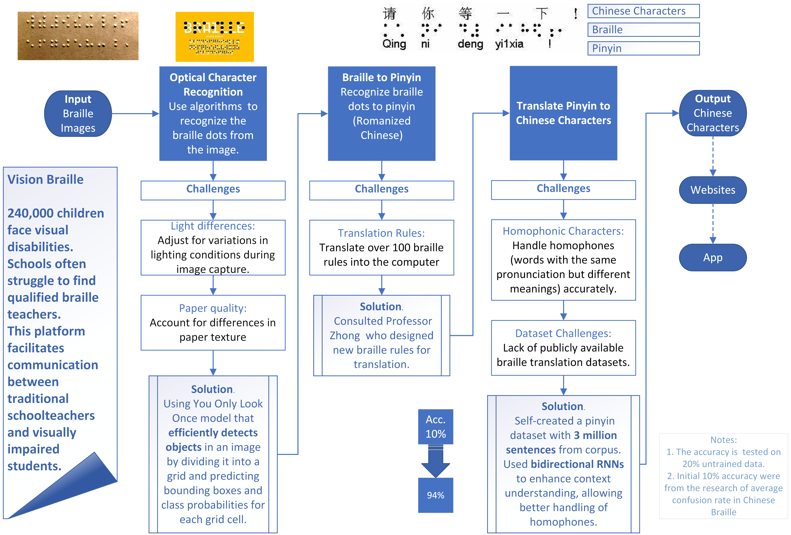
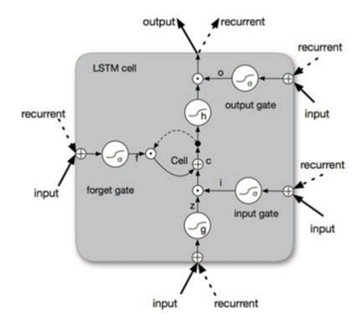
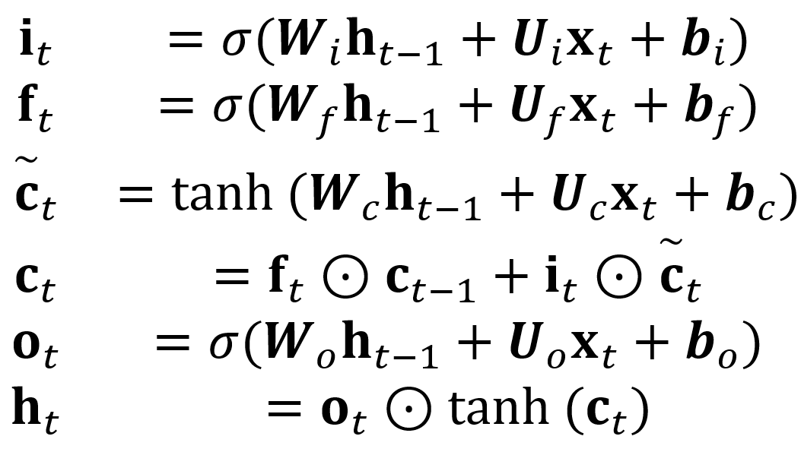
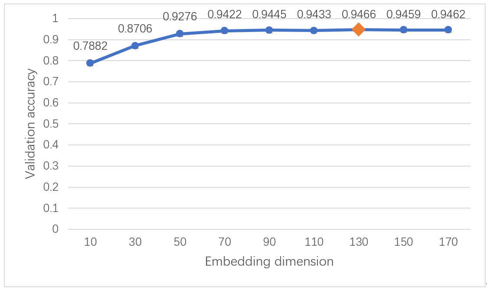

# Vision Braille
 This research used Bi-LSTM to infer the tone from tone-omitted Chinese phonetics.

The Webapp demonstration is in "0_Webapp-braille-vision"

Vision Braille Project: Bridging Education for Blind Children

# Introduction

In China, approximately 240,000 children between the ages of 0 and 17 face visual disabilities. Unfortunately, their educational opportunities remain limited to a handful of specialized schools. These schools often struggle to find qualified braille teachers, making education for blind students a challenging endeavor.

Recognizing this gap, I embarked on the Vision Braille Project. The project aims to empower blind children by providing an innovative solution: a braille translation website. This platform facilitates communication between traditional schoolteachers and visually impaired students. 

How It Works:

- Input Braille Text: Teachers upload written homework or assignments in braille to the website.
- Instant Translation: The website swiftly translates the braille content into standard text (pinyin or Chinese characters).
- Accessible Learning: Teachers can now understand and evaluate the work of blind students, fostering inclusive education.
By bridging this gap, the Vision Braille Project ensures that blind children can learn alongside their sighted peers, unlocking a brighter future for all. 🌟

The tesing app is available at **[Vision Braille Project](http://154.12.37.165:5000/)**

The demon is available at this website: http://154.12.37.165:5000/

# Flow Chart

# Method

## Long Short-Term Memory (LSTM) Networks
To address the limitations of traditional Recurrent Neural Networks (such as gradient vanishing and exploding), we adopt LSTM (Long Short-Term Memory) networks. LSTMs enhance RNNs by introducing three essential components:

Forget Gate:
Prevents gradient explosion and vanishing by selectively retaining relevant historical information.
Allows the model to forget irrelevant past states.

Memory Cell:
Maintains a memory of previous historical information.
Captures long-term dependencies.

Output Gate:
Integrates memory information to produce the final output.
Enables the LSTM to capture long-distance computational relationships.

LSTM Network Architecture; LSTM Structure Figure 3: Illustration of LSTM Structure

Update Equations for Input Data at Time $t$

Where:
$\sigma$ represents the *sigmoid function*. $\odot$ denotes element-wise multiplication. $x_t$ is the input vector at time $t$, which in our case is the word-embedded input vector. $h_t$ represents the hidden state, incorporating all previous states up to time $t$. $U$ and $W$ are the weights and biases for each layer.

**Result after trianing**

We applied word embedding to the pre-constructed data, representing similar words with similar vectors in a high-dimensional space. Using PyTorch, we built a neural network based on the LSTM architecture. The model underwent forward and backward propagation, optimizing weights and biases with Stochastic Gradient Descent. By experimenting with different word embedding dimensions, we observed significant performance gains. Increasing word vector layers improved the model’s understanding of Chinese character categorization.

**Conclusion**

Our project leverages HSK example sentences to build a corpus and designs a deep learning algorithm to predict missing tone marks in Pinyin. The model has significantly improved accuracy, increasing from 78.82% (±0.18%) to 94.66% (±0.13%). Compared to the previous “Bi-directional Gated RNN-based end-to-end Pinyin-to-Chinese character conversion system,” our model outperforms with an accuracy of 87%. This difference is attributed to variations in training database size and model hyperparameters.

This study reaffirms the strength of LSTM networks in sequence labeling tasks. Additionally, the validation accuracy’s positive correlation with embedding dimension underscores the effectiveness of word embeddings in capturing text relationships. Moving forward, we aim to enhance Braille-to-Chinese character translation, complete Braille recognition, and design a more user-friendly interface.

# Optical Braille Translation
Our research utilizes the open-source **DotNeuralNet** for Optical Braille Recognition. DotNeuralNet employs the **YOLOv8-m** model on a Braille recognition database. Key features of DotNeuralNet include:

- **Multi-Label One-Hot Encoding:** DotNeuralNet classifies raised Braille dots using multi-label one-hot encoding. This method converts categorical variables into binary vectors, where each category corresponds to an element in the vector. Only the relevant element is set to 1, while others remain 0.
- **Pseudo-Labeling for Natural Scene Images:** DotNeuralNet also pseudo-labels Braille images captured in natural environments. These images pose additional challenges compared to scanned Braille documents due to factors like lighting, angles, occlusion, and noise. Pseudo-labeling leverages both labeled and unlabeled data to enhance model performance.
- **YOLOv8-m Single-Stage Object Detection:** The YOLOv8-m model performs single-stage object detection on Braille symbols. YOLO models use deep convolutional neural networks to extract image features and divide the image into grids. Each grid predicts a bounding box and class probabilities.

This lightweight model achieves high recognition accuracy, making it a powerful tool for Braille-related applications.

# Contributors for Vision Braille

Special thanks to `@zeturn` for helping to build websites for this project and offering supports. `@Miller` for offering background supports. Teamates at the reserach project at Peking University: Gao Jiayi and Chang Shaosen.

We extend our heartfelt gratitude to the following individuals and institutions:

- Professor Zhang Ming: For providing invaluable guidance on topic selection and the opportunity to participate in the “Deep Learning Seminar” at Peking University. This experience deepened our understanding of natural language processing and cutting-edge deep learning models.
- Ms. Wang Yiping: For expert advice on paper writing and unwavering encouragement during moments of research setbacks. Your support kept us motivated.
- Peking University Computer Science Alumni: Thank you for answering our questions and providing insights.
- Peking University and China Renmin University Affiliated Middle School: Your computational resources significantly accelerated our model training.
Our Parents and Family: Thank you for your unwavering support.

# Acknowledgement

